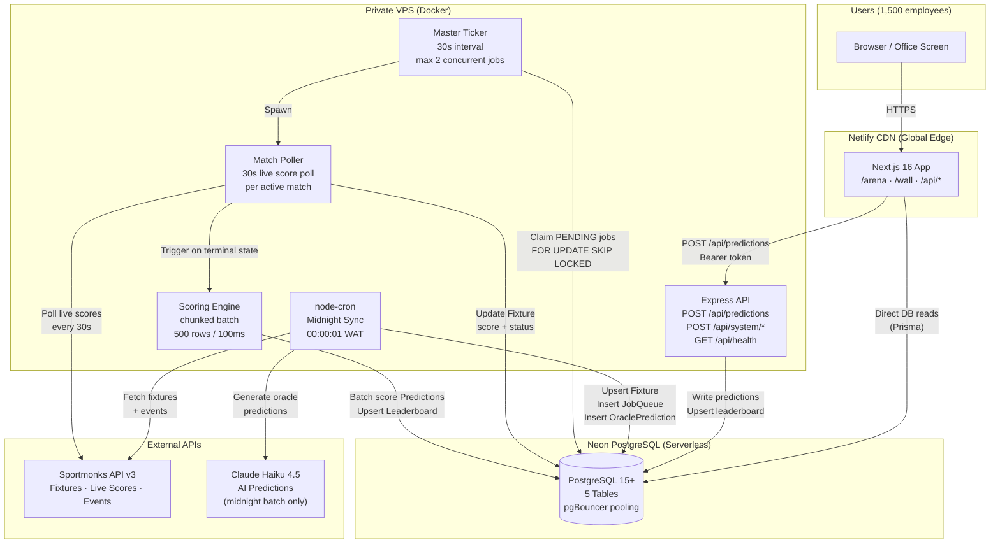
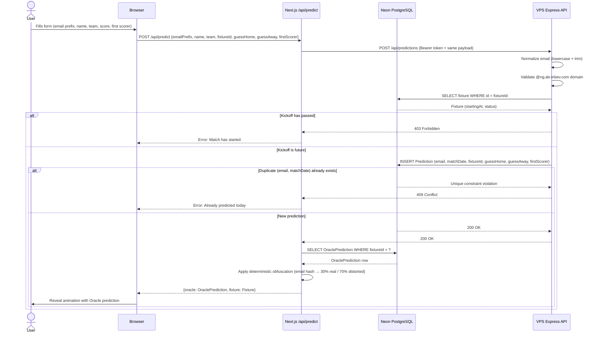
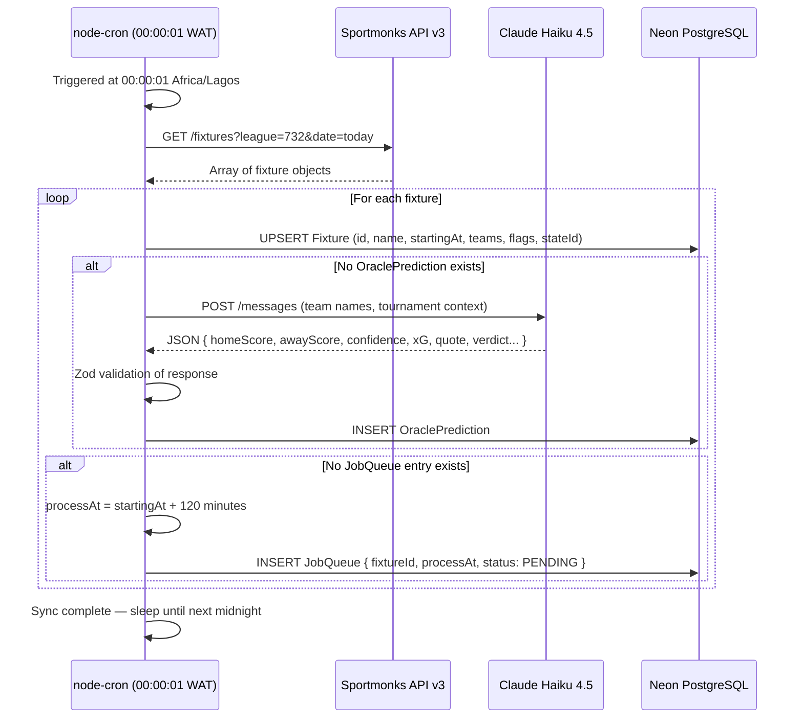
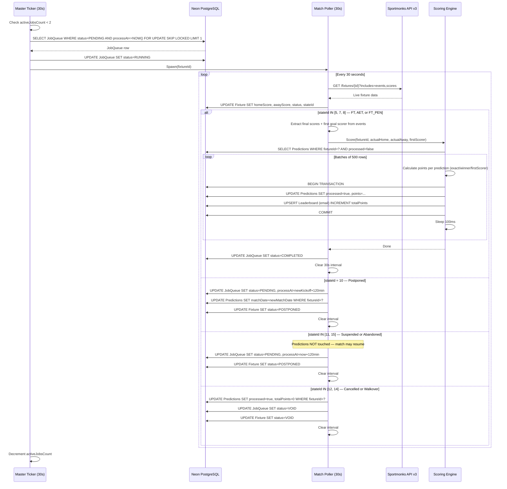
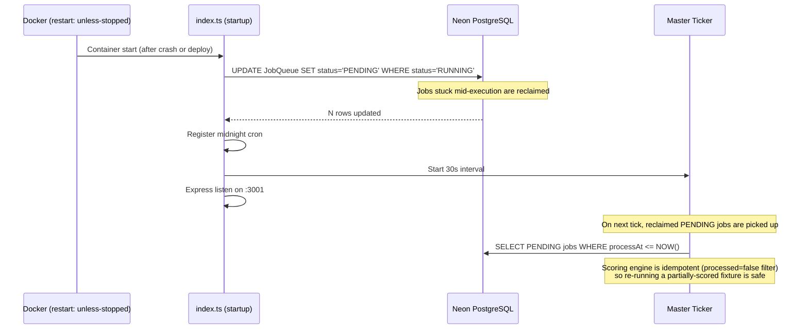
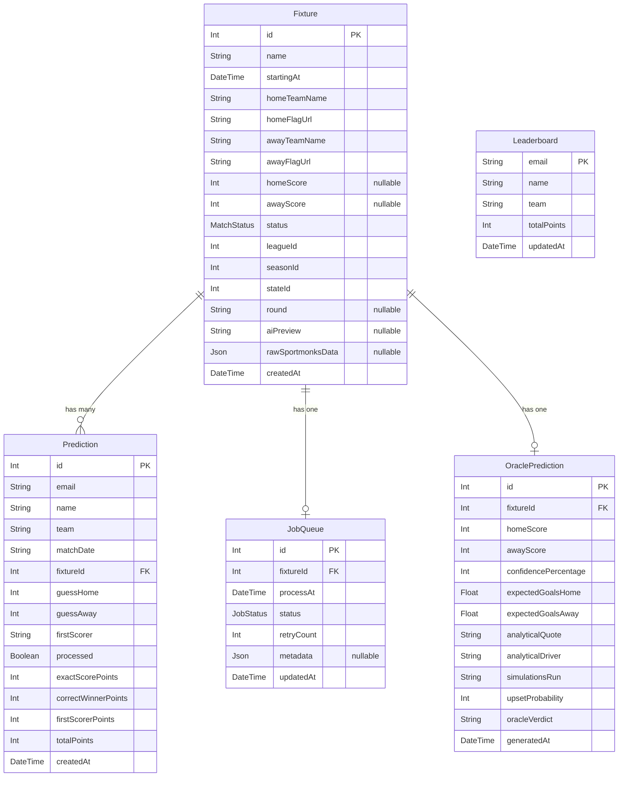
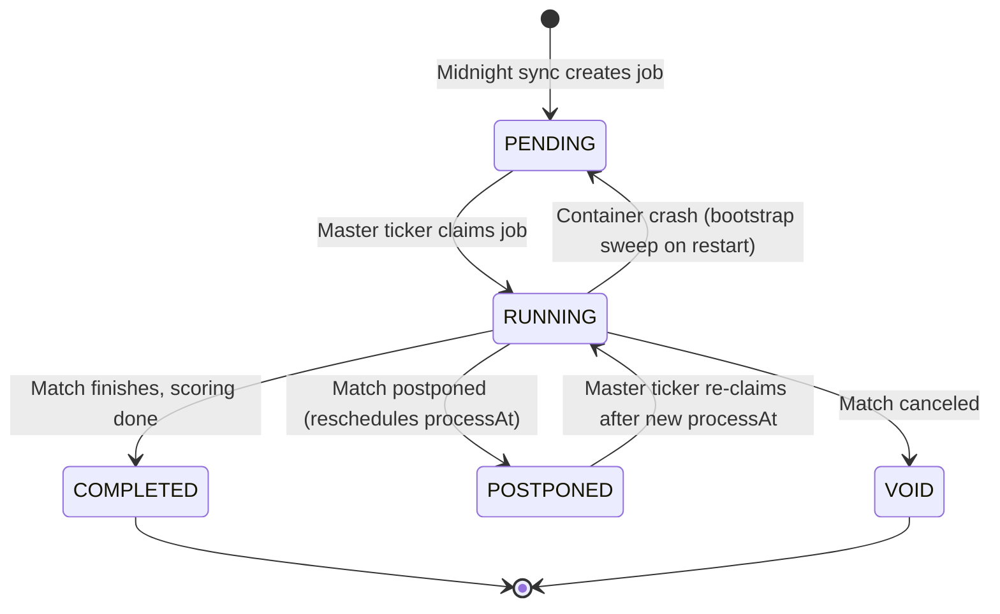

# Oracle — World Cup 2026 AI Prediction Platform
## End-to-End System Documentation

---

## Table of Contents

1. [System Overview](#1-system-overview)
2. [High-Level Architecture](#2-high-level-architecture)
3. [Technology Stack](#3-technology-stack)
4. [Component Deep Dives](#4-component-deep-dives)
   - 4.1 [Frontend — Next.js on Netlify CDN](#41-frontend--nextjs-on-netlify-cdn)
   - 4.2 [Backend Worker — Node.js Docker on VPS](#42-backend-worker--nodejs-docker-on-vps)
   - 4.3 [Database — Neon PostgreSQL](#43-database--neon-postgresql)
   - 4.4 [External Integrations](#44-external-integrations)
5. [Data Flow Diagrams](#5-data-flow-diagrams)
   - 5.1 [User Submits a Prediction](#51-user-submits-a-prediction)
   - 5.2 [Midnight Sync Cron](#52-midnight-sync-cron)
   - 5.3 [Post-Match Scoring Pipeline](#53-post-match-scoring-pipeline)
   - 5.4 [Crash Recovery / Bootstrap Sweep](#54-crash-recovery--bootstrap-sweep)
6. [Database Schema](#6-database-schema)
7. [API Reference](#7-api-reference)
8. [Business Logic](#8-business-logic)
9. [Background Processing](#9-background-processing)
10. [AI Oracle Integration](#10-ai-oracle-integration)
11. [Deployment Architecture](#11-deployment-architecture)
12. [System Invariants](#12-system-invariants)
13. [Failure Modes & Recovery](#13-failure-modes--recovery)
14. [Security Model](#14-security-model)

---

## 1. System Overview

**Oracle** is an AI-powered FIFA World Cup 2026 prediction platform built for ~1,500 AB InBev employees across Nigeria. It runs throughout the tournament, allowing employees to predict the outcome of every match — exact score, winning team, and first goal scorer — before kickoff locks their entry.

After each match ends, the system automatically scores every prediction, awards points, and updates a live leaderboard. The "Oracle" identity is a fictional AI persona that publishes its own predictions for each match, presented with analytical flair to drive engagement.

### What Users Experience

- **Predict**: Visit `/arena`, enter their AB InBev email prefix, pick a team (Team Budweiser or Team Trophy), predict the scoreline and first goal scorer for today's match, and submit. They see the Oracle's own prediction in a dramatic reveal.
- **Compete**: All predictions are scored automatically after the final whistle. Points accumulate across all matches in the tournament.
- **Watch**: Office screens display `/wall` — a broadcast view that rotates through live fixtures and the real-time leaderboard.

### Scale & Constraints

| Dimension | Value |
|-----------|-------|
| Users | ~1,500 AB InBev employees |
| Auth domain | `@ng.ab-inbev.com` only |
| Match frequency | Multiple per day during tournament |
| Prediction window | Open until kickoff; one prediction per user per calendar day |
| Scoring granularity | Per-match, auto-scored 2 hours after kickoff |
| Infrastructure budget | Single VPS (512 MB RAM, 1 CPU) + Neon serverless DB + Netlify CDN |

---

## 2. High-Level Architecture



### Layer Roles at a Glance

| Layer | Technology | Role |
|-------|-----------|------|
| CDN / Frontend | Next.js 16 on Netlify | User-facing UI, reads DB directly, proxies predictions to VPS |
| Backend API | Express on Docker VPS | Prediction ingestion, system admin endpoints |
| Background Workers | node-cron + custom workers | Cron sync, live match polling, automated scoring |
| Database | Neon PostgreSQL + pgBouncer | Single source of truth for all state |
| External: Scores | Sportmonks API v3 | Real fixture data, live scores, goal events |
| External: AI | Claude Haiku 4.5 | Pre-computed oracle predictions (midnight only) |

---

## 3. Technology Stack

### Backend (VPS)

| Category | Technology | Version | Purpose |
|----------|-----------|---------|---------|
| Runtime | Node.js | 20 LTS | Server runtime |
| Language | TypeScript | 5.x | Type-safe backend |
| Framework | Express | 4.x | HTTP server |
| ORM | Prisma | 5.x | Database client + migrations |
| Job Scheduling | node-cron | 3.x | Midnight sync cron |
| AI Client | @anthropic-ai/sdk | Latest | Claude API integration |
| Validation | Zod | 3.x | Runtime schema validation |
| Fuzzy Matching | fast-levenshtein | 2.x | First scorer name matching |
| Container | Docker + docker-compose | 20+ | Deployment and isolation |

### Frontend (Netlify CDN)

| Category | Technology | Version | Purpose |
|----------|-----------|---------|---------|
| Framework | Next.js | 16.2.7 | React app + API routes |
| UI | React | 19 | Component model |
| Styling | Tailwind CSS | v4 | Utility-first CSS |
| Animations | Framer Motion | 11.x | Reveal animations |
| State | Zustand | 5.x | Client-side view state |
| Data Fetching | Native `fetch` + `setInterval` | — | 30s polling for fixtures/leaderboard |
| ORM | Prisma | 5.22.0 | Direct database reads |
| Flags | country-flag-icons | Latest | Team flag images |

### Infrastructure

| Component | Provider | Notes |
|-----------|---------|-------|
| Database | Neon (serverless PostgreSQL) | Auto-scaling, pgBouncer pooling, up to 10,000 connections |
| Frontend CDN | Netlify | Global edge, Next.js plugin, auto-deploys |
| Backend VPS | Private VPS | Single Docker container, 512 MB RAM, 1 CPU |
| API Plugin | @netlify/plugin-nextjs | Netlify-optimized Next.js SSR |

---

## 4. Component Deep Dives

### 4.1 Frontend — Next.js on Netlify CDN

The frontend is a **stateless** Next.js application. It reads fixture, leaderboard, and oracle data directly from Neon PostgreSQL via Prisma (bypassing the VPS entirely), and only hits the VPS to submit predictions.

#### Pages

| Route | Component | Description |
|-------|-----------|-------------|
| `/` | `app/page.tsx` | Home screen with navigation cards to `/arena` and `/wall` |
| `/arena` | `app/arena/page.tsx` | Interactive prediction submission form (client component) |
| `/wall` | `app/wall/page.tsx` | Broadcast display: auto-rotating fixtures + live leaderboard |

#### Next.js API Routes (Server-side)

| Route | Method | Description |
|-------|--------|-------------|
| `/api/predict` | POST | Validates form input, proxies to VPS `/api/predictions`, returns Oracle prediction |
| `/api/fixtures` | GET | Reads all non-VOID fixtures directly from Neon, returns sorted by kickoff time |
| `/api/leaderboard` | GET | Reads top 50 players (this week) + all-time team standings from Neon, obfuscates emails |

#### Key Components

| Component | File | Responsibility |
|-----------|------|----------------|
| Arena page | `app/arena/page.tsx` | Inline state machine (SELECT → PREDICT → LOADING → REVEAL), form controls, reveal UI |
| Wall page | `app/wall/page.tsx` | Broadcast display: auto-rotating fixtures (9s interval) + leaderboard |
| `Leaderboard` | `components/Leaderboard.tsx` | Top 12 ranked players (weekly) + all-time team standings bar chart |
| `OracleMatchCard` | `components/OracleMatchCard.tsx` | Oracle prediction card shown in wall view |
| `Ticker` | `components/Ticker.tsx` | Scrolling bottom ticker with live match stats and static strings |
| `FixtureList` | `components/FixtureList.tsx` | Exists but unused — arena and wall render fixture lists inline |

#### State Management (Zustand)

A minimal Zustand store (`web/lib/store.ts`) tracks `totalPredictions` (incremented client-side on submit). All arena view state (`view`, `selectedMatch`, `oracle`, `homeScore`, `awayScore`, etc.) is managed with `useState` inside `app/arena/page.tsx` — there is no separate hooks directory.

The arena page moves through a linear view state:

```
SELECT_MATCH → PREDICT → LOADING → REVEAL
```

- `SELECT_MATCH`: User picks a fixture from the fixture list
- `PREDICT`: Form is active and editable
- `LOADING`: Form submitted, awaiting VPS response
- `REVEAL`: Oracle prediction displayed alongside the user's guess

#### Data Fetching

All polling uses native `fetch` inside `useCallback` + `setInterval`. There is no SWR library.

| Page | Endpoint | Interval |
|------|----------|---------|
| `/arena` | `/api/fixtures` | Every 30 seconds |
| `/wall` | `/api/fixtures` | Every 30 seconds |
| `/wall` | `/api/leaderboard` | Every 30 seconds |

The wall auto-rotates between fixtures every **9 seconds** via a separate `setInterval`.

#### Direct Database Reads

The frontend Prisma client (`web/lib/db.ts`) connects directly to Neon with a pooled `DATABASE_URL`. This means:
- Fixture lists and leaderboard data are served from the DB without touching the VPS
- The VPS is reserved for write operations only (prediction ingestion)
- Netlify edge functions cold-start time is the only latency concern for reads

---

### 4.2 Backend Worker — Node.js Docker on VPS

The VPS runs a **single Docker container** with three co-located concerns:

1. **Express HTTP server** — prediction ingestion + admin endpoints
2. **Cron worker** — midnight fixture sync
3. **Background automation** — master ticker, match pollers, scoring engine

#### Entry Point: `server/src/index.ts`

On startup, `index.ts` performs in order:
1. **Bootstrap sweep** — resets any RUNNING jobs to PENDING (crash recovery)
2. **Cron registration** — registers midnight sync at `00:00:01 Africa/Lagos`
3. **Master ticker start** — begins 30-second interval loop
4. **Express listen** — binds HTTP on port 3001

#### Routes

| File | Endpoint | Method | Auth |
|------|----------|--------|------|
| `routes/predictions.ts` | `/api/predictions` | POST | Bearer token |
| `routes/system.ts` | `/api/system/sync-day` | POST | Bearer token |
| `routes/system.ts` | `/api/system/recover-state` | POST | Bearer token |
| `routes/health.ts` | `/api/health` | GET | Public |

#### Middleware

| File | Purpose |
|------|---------|
| `middleware/cors.ts` | Restricts origin to `CORS_ALLOWED_ORIGIN` env var (the Netlify URL) |
| `middleware/auth.ts` | Validates `Authorization: Bearer <VPS_SECRET_TOKEN>` header |

#### Cron: `crons/midnight-sync.ts`

Runs at `00:00:01 WAT` (Africa/Lagos timezone) every day. Steps:
1. Fetch all World Cup fixtures from Sportmonks API
2. Upsert each fixture into the `Fixture` table
3. For fixtures without an `OraclePrediction`: call Claude Haiku to generate oracle analysis
4. For fixtures without a `JobQueue` entry: insert a job with `processAt = kickoff + 120 minutes`

#### Workers: `workers/master-ticker.ts`

Runs every 30 seconds. Steps:
1. Check `activeJobsCount < 2` (in-memory semaphore)
2. Query `JobQueue` for the next PENDING job where `processAt <= NOW()` — uses `FOR UPDATE SKIP LOCKED` to prevent race conditions
3. Mark job as RUNNING
4. Spawn `match-poller` for the fixture
5. Decrement `activeJobsCount` on completion or error

#### Workers: `workers/match-poller.ts`

One instance per active match, polls every 30 seconds. Steps:
1. Call Sportmonks for the fixture's current state and events
2. Update `Fixture` with latest `homeScore`, `awayScore`, `status`, `stateId`
3. Check for terminal state (`stateId IN [5, 7, 8]` — FT, AET, or FT_PEN)
4. On terminal state: invoke scoring engine, then mark `JobQueue` as COMPLETED
5. On POSTPONED state (`stateId = 10`): reschedule job, update `matchDate` in Prediction rows
6. On VOID state (`stateId IN [11, 12]`): mark all predictions `processed=true, totalPoints=0`, mark job VOID

#### Engine: `engines/scoring-engine.ts`

Triggered by match poller on terminal state. Steps:
1. Fetch all unprocessed predictions for the fixture (`processed = false`)
2. Extract actual home/away score from Sportmonks events
3. Extract first goal scorer name from events (goal type IDs 14 & 16, excludes ID 23 shootouts)
4. Process predictions in batches of 500
5. For each batch: calculate points, mark `processed = true`, upsert leaderboard — all in one transaction
6. Sleep 100ms between batches to yield connection pool

---

### 4.3 Database — Neon PostgreSQL

A single Neon serverless PostgreSQL instance is the shared source of truth for both the VPS backend and the Next.js frontend. Schema is managed via Prisma and must remain identical in both `server/prisma/schema.prisma` and `web/prisma/schema.prisma`.

Connection strategy:
- **Pooled URL** (`DATABASE_URL`): used for all app queries, routes through pgBouncer in transaction mode
- **Direct URL** (`DIRECT_URL`): used only for Prisma migrations (bypasses pgBouncer)
- **Connection limit**: 5 per app deployment (VPS + Netlify) for stability

#### Tables Summary

| Table | Primary Key | Row Semantics |
|-------|------------|---------------|
| `Fixture` | `id` (Sportmonks ID) | One row per World Cup match |
| `Prediction` | `id` (autoincrement) | One row per user-per-match-day |
| `Leaderboard` | `email` | Running total per user, updated after each match |
| `JobQueue` | `id` (autoincrement) | One row per fixture, drives background scoring |
| `OraclePrediction` | `id` (autoincrement) | One row per fixture, stores Claude's analysis |

---

### 4.4 External Integrations

#### Sportmonks API v3 (`lib/sportmonks.ts`)

Sportmonks is the authoritative source for fixture data, live scores, and match events.

**Base URL**: `https://api.sportmonks.com/v3/football`

**State ID Mapping** (Sportmonks `state_id` → internal status):

| State ID | Sportmonks Code | Meaning | Internal `MatchStatus` | Triggers |
|----------|----------------|---------|----------------------|---------|
| 1 | NS | Not Started | `NOT_STARTED` | — |
| 2 | INPLAY_1ST_HALF | 1st Half | `LIVE` | — |
| 3 | HT | Half-Time | `LIVE` | — |
| 4 | BREAK | Regular Time Finished, awaiting ET | `LIVE` | — |
| **5** | **FT** | **Full Time (90 min)** | **`FINISHED`** | **Scoring** |
| 6 | INPLAY_ET | Extra Time in play | `LIVE` | — |
| **7** | **AET** | **After Extra Time** | **`FINISHED`** | **Scoring** |
| **8** | **FT_PEN** | **Full Time After Penalties** | **`FINISHED`** | **Scoring** |
| 9 | INPLAY_PENALTIES | Penalty Shootout in progress | `LIVE` | — |
| 10 | POSTPONED | Postponed to another date | `POSTPONED` | Reschedule job |
| 11 | SUSPENDED | Suspended, will continue later | `POSTPONED` | Reschedule job +2h |
| 12 | CANCELLED | Permanently cancelled | `VOID` | Zero predictions |
| 13 | TBA | Date not yet confirmed | `NOT_STARTED` | — |
| 14 | WO | Walkover (no match played) | `VOID` | Zero predictions |
| 15 | ABANDONED | Abandoned, may resume | `POSTPONED` | Reschedule job +2h |

**`TERMINAL_STATE_IDS`** (triggers scoring): `[5, 7, 8]`
**`VOID_STATE_IDS`** (zeros predictions): `[12, 14]`
**`SUSPENDED_STATE_IDS`** (reschedules job, does not touch predictions): `[11, 15]`

**Goal Event Type IDs**:

| Type ID | Meaning | Used For |
|---------|---------|---------|
| 14 | Normal goal | First scorer extraction ✓ |
| 16 | Own goal | First scorer extraction ✓ |
| 23 | Penalty shootout goal | **Excluded** from first scorer |

#### Claude Haiku 4.5 (`lib/claude.ts`)

Used exclusively during the midnight sync to generate pre-computed oracle predictions. Never called per user request.

**Model**: `claude-haiku-4-5` (low cost, fast, sufficient for structured JSON output)

**Prompt strategy**: Structured JSON output via Zod schema validation. The prompt provides team names, tournament context, and requests a JSON object conforming to the `OraclePrediction` shape.

**Output schema validated by Zod**:

```typescript
{
  homeScore: number,           // Predicted score
  awayScore: number,
  confidencePercentage: number, // 0–100
  expectedGoalsHome: number,   // xG metric
  expectedGoalsAway: number,
  analyticalQuote: string,     // ≤120 chars — key insight
  analyticalDriver: string,    // ≤40 chars — prediction rationale
  simulationsRun: string,      // e.g. "1.4M"
  upsetProbability: number,    // 0–100
  oracleVerdict: "HOME_WIN" | "AWAY_WIN" | "DRAW"
}
```

The true prediction is stored as-is in `OraclePrediction`. Display-time obfuscation is applied by the Next.js layer only (never stored distorted).

---

## 5. Data Flow Diagrams

### 5.1 User Submits a Prediction



---

### 5.2 Midnight Sync Cron



---

### 5.3 Post-Match Scoring Pipeline



---

### 5.4 Crash Recovery / Bootstrap Sweep



---

## 6. Database Schema

### Entity-Relationship Diagram



### Indexes

| Table | Index | Type | Purpose |
|-------|-------|------|---------|
| `Prediction` | `(email, matchDate)` | UNIQUE | Primary duplicate guard — one prediction per user per day |
| `Prediction` | `(fixtureId, processed)` | Composite | Fast lookup of unscored predictions per fixture |
| `Leaderboard` | `totalPoints DESC` | Standard | Fast top-N ranking query |
| `JobQueue` | `fixtureId` | UNIQUE | Ensures exactly one job per fixture |

### Enums

**`MatchStatus`**: `NOT_STARTED` | `LIVE` | `FINISHED` | `POSTPONED` | `VOID`

**`JobStatus`**: `PENDING` | `RUNNING` | `COMPLETED` | `POSTPONED` | `VOID`

---

## 7. API Reference

### VPS Backend Endpoints

All VPS endpoints require `Authorization: Bearer <VPS_SECRET_TOKEN>` except `/api/health`.

---

#### `POST /api/predictions`

Submit a user's prediction for a match.

**Auth**: Bearer token

**Rate limits**: 200 req/min global · 3 req/min per email prefix

**Request Body**:
```json
{
  "emailPrefix": "john.doe",
  "name": "John Doe",
  "team": "Team Budweiser",
  "fixtureId": 123456,
  "guessHome": 2,
  "guessAway": 1,
  "firstScorer": "Vinicius Jr"
}
```

**Success Response** `200 OK`:
```json
{ "message": "Prediction recorded" }
```

**Error Responses**:

| Code | Condition |
|------|-----------|
| `400` | Validation failure (bad email, score out of range, missing fields) |
| `400` | User already predicted on this calendar day |
| `403` | Kickoff time has passed |
| `404` | Fixture not found |
| `429` | Rate limit exceeded (global: 200/min or per-email: 3/min) |
| `500` | Database or server error |

**Internal logic**:
1. Normalize email: `emailPrefix.trim().toLowerCase() + "@ng.ab-inbev.com"`
2. Validate against regex `^[a-z0-9._-]+@ng\.ab-inbev\.com$`
3. Fetch fixture, compare `Date.now() >= fixture.startingAt.getTime()`
4. Extract `matchDate` as `YYYY-MM-DD` from `fixture.startingAt` (UTC)
5. `INSERT Prediction` — unique constraint `(email, matchDate)` enforces one-per-day

---

#### `POST /api/system/sync-day`

Trigger the daily fixture sync manually (also runs automatically at midnight).

**Auth**: Bearer token

**Request Body**: none

**Response** `200 OK`:
```json
{ "message": "Sync complete", "fixturesProcessed": 8 }
```

---

#### `POST /api/system/recover-state`

Reset stuck RUNNING jobs to PENDING for crash recovery.

**Auth**: Bearer token

**Response** `200 OK`:
```json
{ "message": "State recovered", "jobsReset": 2 }
```

---

#### `GET /api/health`

Health check endpoint for monitoring.

**Auth**: Public

**Response** `200 OK`:
```json
{
  "status": "ok",
  "uptime": 86400.5,
  "memoryMB": 128.4,
  "timestamp": "2026-06-01T14:00:00.000Z",
  "db": "connected"
}
```

---

### Next.js API Routes (Frontend)

These run as Netlify serverless functions. They read directly from Neon or proxy to the VPS.

---

#### `POST /api/predict`

Proxy prediction to VPS, then return Oracle's prediction.

**Request Body**: Same as VPS `/api/predictions`

**Success Response** `200 OK`:
```json
{
  "oracle": {
    "homeScore": 2,
    "awayScore": 1,
    "confidencePercentage": 67,
    "expectedGoalsHome": 1.8,
    "expectedGoalsAway": 1.2,
    "analyticalQuote": "...",
    "analyticalDriver": "...",
    "simulationsRun": "1.4M",
    "upsetProbability": 28,
    "oracleVerdict": "HOME_WIN"
  },
  "fixture": { ... }
}
```

Note: `oracle` data is deterministically obfuscated before response (30% real, 70% distorted based on email hash).

---

#### `GET /api/fixtures`

Return all non-VOID fixtures ordered by kickoff time. VOID fixtures are excluded entirely — no cancelled-match badge is shown in the UI.

**Response** `200 OK` (`Cache-Control: no-store`):
```json
{
  "fixtures": [
    {
      "id": 123456,
      "name": "Brazil vs Argentina",
      "startingAt": "2026-06-01T18:00:00.000Z",
      "homeTeamName": "Brazil",
      "homeFlagUrl": "https://...",
      "awayTeamName": "Argentina",
      "awayFlagUrl": "https://...",
      "homeScore": null,
      "awayScore": null,
      "status": "NOT_STARTED",
      "round": "Group Stage",
      "aiPreview": "A tactical battle..."
    }
  ]
}
```

---

#### `GET /api/leaderboard`

Return top 50 players for the current week (Monday midnight WAT to now) and all-time team standings.

**Response** `200 OK`:
```json
{
  "leaderboard": [
    {
      "rank": 1,
      "name": "John D.",
      "email": "jo***oe@ng.ab-inbev.com",
      "team": "Team Budweiser",
      "totalPoints": 240
    }
  ],
  "teamStandings": [
    { "team": "Team Budweiser", "_sum": { "totalPoints": 12400 } },
    { "team": "Team Trophy",   "_sum": { "totalPoints": 11800 } }
  ]
}
```

- `leaderboard`: weekly scope (Monday midnight WAT reset), top 50 from DB, top 12 rendered on screen
- `teamStandings`: all-time (entire tournament, no weekly filter)
- Email obfuscation: first 2 + last 2 chars of local part + 3+ stars — `john.doe` → `jo***oe@ng.ab-inbev.com`

---

## 8. Business Logic

### Email Handling

1. User supplies only the prefix (e.g., `john.doe`) — never the full email in the form
2. Backend appends `@ng.ab-inbev.com` and normalizes: `.trim().toLowerCase()`
3. Validated against: `^[a-z0-9._-]+@ng\.ab-inbev\.com$`
4. This normalized email is the identity key for all predictions and the leaderboard

### Calendar Day Lock

The unique constraint `(email, matchDate)` enforces **one prediction per user per calendar day**.

`matchDate` is derived from `fixture.startingAt` in UTC as `YYYY-MM-DD`. This means:
- A user who predicts for a match on June 1 cannot submit another prediction on June 1, regardless of which match they chose (note: in World Cup group stage, typically one match per day is relevant)
- If a match is postponed, the user's `matchDate` is updated to the new date, restoring their slot for the original date

### Kickoff Gate

Before inserting a prediction, the server checks:
```
Date.now() >= fixture.startingAt.getTime()  →  403 Forbidden
```
This is the server-side authority — the frontend also disables the form, but the backend enforces it.

### Score Validation

- `guessHome` and `guessAway` must be integers in range `0–9`
- Validated via Zod schema on the server
- UI uses stepper controls (increment/decrement buttons, not free text)

### Points Matrix

| Outcome | Points |
|---------|--------|
| Exact score match (`guessHome == actualHome && guessAway == actualAway`) | **50 pts** |
| Correct outcome only (win/draw direction matches, but score wrong) | **20 pts** |
| Wrong outcome | **0 pts** |
| First scorer bonus (Levenshtein similarity ≥ 70%) | **+10 pts** |

**Maximum per match**: 50 + 10 = **60 points** (exact score + first scorer bonus)

Exact score and correct outcome are **mutually exclusive** — exact score supersedes. First scorer **stacks** on either branch.

### First Scorer Matching (Fuzzy)

```
similarity = 1 - levenshteinDistance(guess, actual) / max(len(guess), len(actual))
if similarity >= 0.70 → award 10 points
```

Uses `fast-levenshtein`. Tolerates spelling variants, accents, abbreviations (e.g. "Mbappe" vs "Mbappé"). Threshold is fixed at 0.70 — not configurable — for deterministic, auditable scoring.

### Postponed Match Handling

When Sportmonks reports `stateId = 10`:
1. Job `processAt` is updated to `newKickoff + 120 minutes`
2. `JobQueue.status` set to `POSTPONED`
3. All `Prediction` rows for the fixture get `matchDate` updated to the new calendar date
4. User's original match date slot is freed (they can predict another match that day)
5. Their prediction for the postponed match remains valid and will be scored on the new date

### Void / Cancelled Match Handling

When Sportmonks reports `stateId IN [12, 14]`:
1. All `Prediction` rows: `processed = true`, `totalPoints = 0`
2. `JobQueue.status` set to `VOID`
3. Fixture status set to `VOID` in the DB
4. **Frontend hides VOID fixtures entirely** — the `/api/fixtures` route excludes `status: 'VOID'` rows, so cancelled matches never appear in the UI
5. Leaderboard is not affected (no points awarded or deducted)

---

## 9. Background Processing

### Master Ticker Concurrency Model

The ticker runs a 30-second `setInterval`. It maintains an in-memory integer `activeJobsCount` (initialized to 0 on startup).

```
Every 30s:
  if activeJobsCount >= 2 → skip this tick
  claim next PENDING job (FOR UPDATE SKIP LOCKED)
  if job found:
    mark RUNNING
    activeJobsCount++
    spawn match poller (async, non-blocking)
    on completion → activeJobsCount--
```

`FOR UPDATE SKIP LOCKED` is critical: it makes job claiming atomic and safe against concurrent ticks racing to claim the same job. Since this is a single-instance worker, the race condition is between ticker ticks, not separate processes — but the SQL pattern is correct for both scenarios.

### Job Lifecycle State Machine



### Match Poller Loop

```
Spawn poller for fixtureId
  setInterval(30s):
    call Sportmonks GET /fixtures/{id}
    update Fixture in DB (score, status, stateId)
    if stateId IN [5,7,8]:
      extract final scores and first scorer from events
      call scoring engine
      mark JobQueue COMPLETED
      clearInterval
    elif stateId == 10:
      update processAt to newKickoff + 120min
      update matchDate in Predictions
      clearInterval
    elif stateId IN [12,14]:
      zero out Predictions
      mark JobQueue VOID
      clearInterval
```

### Scoring Engine Batch Mechanics

```
scoringEngine(fixtureId, actualHome, actualAway, firstScorerName):
  predictions = SELECT * FROM Prediction WHERE fixtureId=? AND processed=false
  
  for batch in chunks(predictions, 500):
    BEGIN TRANSACTION
    for each prediction in batch:
      points = calculatePoints(prediction, actualHome, actualAway, firstScorerName)
      UPDATE Prediction SET processed=true, exactScorePoints=?, correctWinnerPoints=?, firstScorerPoints=?, totalPoints=?
      UPSERT Leaderboard SET totalPoints += points
    COMMIT
    SLEEP 100ms
```

The 100ms sleep between batches prevents overwhelming the Neon serverless connection pool and gives the Node.js event loop breathing room.

---

## 10. AI Oracle Integration

### When AI Runs

The Claude API is called **only during the midnight sync**, never per user request. This means:
- Zero per-request LLM inference cost
- Zero added latency for prediction submission
- Predictions are always available before users visit

### What Claude Generates

For each fixture, the midnight sync calls Claude Haiku with the teams, tournament context, and a structured prompt requesting a JSON analysis object. The response is validated with Zod before storage.

**Fields stored in `OraclePrediction`**:

| Field | Type | Description |
|-------|------|-------------|
| `homeScore` / `awayScore` | `Int` | Oracle's predicted final score |
| `confidencePercentage` | `Int` (0–100) | How confident the Oracle is |
| `expectedGoalsHome/Away` | `Float` | xG metrics (e.g., 1.8 vs 1.2) |
| `analyticalQuote` | `String` (≤120 chars) | One-line analytical insight shown to users |
| `analyticalDriver` | `String` (≤40 chars) | Short label for the key factor |
| `simulationsRun` | `String` | Flavor text (e.g., "1.4M simulations") |
| `upsetProbability` | `Int` (0–100) | Chance of an upset |
| `oracleVerdict` | `String` | `HOME_WIN` / `AWAY_WIN` / `DRAW` |

### Oracle Obfuscation (Display Layer)

The true `OraclePrediction` is **never distorted in the database**. Distortion happens only in `web/lib/oracle-obfuscation.ts`, applied in `web/app/api/predict/route.ts`, deterministically based on the user's email **and fixtureId**:

```
hash = deterministicHash(`${email}:${fixtureId}`)
if hash % 10 < 3:  // 30% of users (per fixture)
  show real Oracle prediction
else:               // 70% of users (per fixture)
  homeScore ± 1, awayScore ± 1
  oracleVerdict recomputed from distorted scores
  expectedGoalsHome ± 0.2, expectedGoalsAway ± 0.2
  confidencePercentage ± 5 (clamped to 55–95%)
```

**Not distorted**: `analyticalQuote`, `analyticalDriver`, `upsetProbability`, `simulationsRun`

**Hash key is per user+fixture** — the same user may see the real prediction for one match and a distorted prediction for another. This is by design.

**Simulations display**: The arena reveal always animates to a hardcoded **1.4M** counter (using `useCountUp`). The `oracle.simulationsRun` field from the API is stored flavor text (e.g. `"1.4M"`) but the UI does not read it for the counter.

**oracleVerdict**: The `HOME_WIN` / `AWAY_WIN` / `DRAW` verdict is stored in the DB and returned in the API response but is **not rendered** as a badge in the arena reveal UI — it is implied by the displayed scores.

**Why**: Prevents users from reverse-engineering the Oracle's predictions to gain an edge. The same user always sees the same version for a given fixture (deterministic hash), so the experience is consistent per person per match. The real data is preserved for analytics, wall display, and post-tournament review.

---

## 11. Deployment Architecture

### VPS — Docker

**`server/docker-compose.yml`**:

```yaml
services:
  oracle-worker:
    build: .
    restart: unless-stopped
    ports:
      - "3001:3001"
    env_file: .env
    deploy:
      resources:
        limits:
          memory: 512m
          cpus: "1"
```

**`server/Dockerfile`** — Multi-stage build:
- Stage 1 (`builder`): Node 20 Alpine, installs dependencies, compiles TypeScript
- Stage 2 (`runner`): Node 20 Alpine, copies compiled output only — minimal image

**Restart policy**: `unless-stopped` — Docker automatically restarts the container after crashes, OS reboots, or OOM kills. The bootstrap sweep on startup handles recovery.

### Netlify — Next.js Frontend

**`web/netlify.toml`**:
```toml
[build]
  command = "npm run build"
  publish = ".next"

[[plugins]]
  package = "@netlify/plugin-nextjs"
```

Netlify handles:
- CDN edge caching of static assets
- SSR/API routes as serverless functions
- Automatic redeploy on git push

### Environment Variables

**VPS (`.env`)**:

| Variable | Purpose |
|----------|---------|
| `DATABASE_URL` | Neon pooled connection (pgbouncer=true, connection_limit=5) |
| `DIRECT_URL` | Neon direct connection (for Prisma migrations only) |
| `VPS_SECRET_TOKEN` | Bearer token for all protected endpoints (≥64 chars, generated securely) |
| `SPORTMONKS_API_TOKEN` | Sportmonks v3 API key |
| `CLAUDE_API_KEY` | Anthropic API key |
| `SPORTMONKS_LEAGUE_ID` | `732` (FIFA World Cup) |
| `CORS_ALLOWED_ORIGIN` | Netlify deployment URL (e.g., `https://oracle.netlify.app`) |
| `TZ` | `Africa/Lagos` (WAT, UTC+1) |

**Netlify (environment settings)**:

| Variable | Purpose |
|----------|---------|
| `VPS_BASE_URL` | VPS base URL (e.g., `https://api.yourserver.com`) |
| `VPS_SECRET_TOKEN` | Same token as VPS — never exposed to browser |
| `DATABASE_URL` | Neon pooled connection for direct reads |
| `NEXT_TELEMETRY_DISABLED` | `1` — disables Next.js telemetry |

### Secret Boundary

```
Browser (untrusted)
   ↓ HTTPS (no token)
Next.js /api/* (Netlify serverless — server-side only)
   ↓ Bearer <VPS_SECRET_TOKEN> (injected at request time, never in client bundle)
VPS Express API
```

`VPS_SECRET_TOKEN` never appears in browser network traffic, client-side JavaScript bundles, or API responses.

---

## 12. System Invariants

These rules are non-negotiable. Violating any of them is a defect, not a configuration choice.

| # | Invariant | Why |
|---|-----------|-----|
| 1 | `UNIQUE(email, matchDate)` is enforced at the database level | Application checks are an optimization; the DB constraint is the source of truth. Concurrent requests cannot race past it. |
| 2 | Email normalized to `lowercase + trim` before every DB operation | `User@Domain` and `user@domain ` must collide. Without normalization, the same person creates multiple identities and bypasses the duplicate guard. |
| 3 | Email must match `^[a-z0-9._-]+@ng\.ab-inbev\.com$` (server-side, post-normalization) | Restricts participation to AB InBev Nigeria employees. Client validation is UX only — server is authority. |
| 4 | Kickoff gate: `Date.now() >= fixture.startingAt.getTime()` → 403 | Predictions must be locked at kickoff. Live score information must not be usable. |
| 5 | Scoring engine only processes rows where `processed = false` | Idempotency. A job may be retried after a crash. Processing already-scored rows would double-award points and corrupt the leaderboard. After scoring, rows flip to `processed = true` in the same transaction. |
| 6 | Bootstrap sweep runs on every container start: reset RUNNING → PENDING | A crash mid-job leaves RUNNING orphans. This sweep reclaims them. Combined with invariant 5, re-running is always safe. |
| 7 | Max 2 concurrent match jobs (in-memory `activeJobsCount`) | Bounds Sportmonks API call volume and CPU/RAM on the VPS (512 MB / 1 CPU). Assumes a single worker instance — do not scale horizontally without a distributed lock. |
| 8 | Oracle true prediction is never distorted in the database | Display-time obfuscation only. Storing distorted data would corrupt analytics and make the 30/70 split unrecoverable. |
| 9 | Points: `exactScore=50`, `correctWinner=20`, `firstScorer=+10` | Fixed, auditable scoring. Exact and correct-winner are mutually exclusive (exact supersedes). First scorer stacks. |
| 10 | First scorer fuzzy match threshold: ≥ 70% Levenshtein similarity | Tolerates spelling variants while rejecting wrong names. Fixed threshold for deterministic, reproducible scoring. |
| 11 | Scoring batch size: 500 rows, 100ms sleep between batches | Prevents large transactions from locking the Prediction table and overwhelming the Neon connection pool. |
| 12 | `processAt = fixture.startingAt + 120 minutes` | Jobs become eligible 2 hours after kickoff — enough time for 90-minute match + stoppage. Stored as absolute UTC timestamp. |
| — | `VPS_SECRET_TOKEN` server-side only, never in client bundles | Secret boundary. Browser never has the token. |
| — | `web/prisma/schema.prisma` must be byte-identical to `server/prisma/schema.prisma` | Schema drift breaks type-safe reads. Single source of schema. |
| — | Scoring only triggers on `stateId IN [5, 7, 8]` (FT, AET, FT_PEN) | Only terminal match states are valid for scoring. State 9 (INPLAY_PENALTIES) is live — scoring must not fire during a shootout. |
| — | First scorer extraction excludes `type_id = 23` (shootout penalties) | Shootout goals are post-match events. Including them would falsely award first-scorer points for penalty shootouts. |

---

## 13. Failure Modes & Recovery

### Known Risks and Mitigations

| Risk | Impact | Mitigation |
|------|--------|------------|
| Sportmonks `result` field format changes | Incorrect score extraction → wrong points | Scoring reads from `events` array (goal type IDs 14/16) not a single `result` field; format changes would surface as a scoring anomaly quickly |
| Neon `FOR UPDATE SKIP LOCKED` behavior change | Jobs double-claimed → double-scoring | Invariant 5 (`processed=false` filter) is the final safety net even if locking fails |
| Single-instance worker crash | Active pollers stop, jobs stuck in RUNNING | Bootstrap sweep on restart reclaims all RUNNING jobs. Scoring is idempotent. |
| Claude API JSON drift (response not matching schema) | OraclePrediction not generated | Zod validation catches drift; fixture gets no oracle data; user sees fallback UI |
| WAT timezone misconfiguration | Midnight sync fires at wrong time | `TZ=Africa/Lagos` in Docker env; node-cron uses process timezone |
| Duplicate guard edge case: user submits nanoseconds before kickoff | Prediction accepted but match already live | Kickoff gate uses `>=` comparison; clock skew of <1s is accepted risk |
| Postponement reassignment | User can predict twice for same original date | `matchDate` update is atomic with job reschedule; only one date exists per prediction row at any time |
| Obfuscation leak: same email always gets same obfuscation bucket | 30% of users always see real oracle | By design (deterministic). The 70% majority see distorted data — acceptable for engagement mechanics |
| Rate limiting on Sportmonks | Poller requests rejected (429) | Not currently handled with retry backoff — add exponential backoff if rate limits are encountered in production |
| 10 matches on same day (scoring delay) | Matches 3–10 queue; scoring delayed until earlier slots free | Accepted tradeoff on 512 MB VPS. Scoring is delayed, not wrong. Maximum slot wait: ~2 hours per pair of matches. |
| Prediction burst (1,500 users submitting simultaneously) | 5-connection pool queue depth → HTTP timeouts | Mitigated: `express-rate-limit` enforces 200 req/min global + 3 req/min per email. Drains burst to manageable throughput. |

### Recovery Playbook

**Scenario: Container crashed mid-scoring**
1. Docker auto-restarts container (`unless-stopped`)
2. Bootstrap sweep resets the job to PENDING
3. Master ticker picks it up on the next tick
4. Scoring engine queries `processed=false` — already-scored predictions are skipped
5. Leaderboard upsert is idempotent (uses `totalPoints += delta` only on unprocessed rows)
6. Net result: no double-scoring, no data loss

**Scenario: Midnight sync missed (container was down at midnight)**
1. Call `POST /api/system/sync-day` manually with the Bearer token
2. Sync is idempotent — already-existing Fixture, JobQueue, and OraclePrediction rows are skipped (upsert/check-before-insert)

**Scenario: Jobs stuck in RUNNING after manual restart**
1. Call `POST /api/system/recover-state` manually
2. Resets all RUNNING → PENDING
3. Master ticker picks them up

---

## 14. Security Model

### Authentication

All mutating VPS endpoints require `Authorization: Bearer <VPS_SECRET_TOKEN>`. The token is:
- ≥64 characters, generated cryptographically (e.g., `openssl rand -hex 32`)
- Stored only in VPS `.env` and Netlify environment variables (server-side)
- Never returned in any API response
- Never included in client-side JavaScript bundles

`GET /api/health` is intentionally public (monitoring tools do not carry secrets).

### CORS

The VPS only accepts requests from `CORS_ALLOWED_ORIGIN` (the Netlify deployment URL). Any request from a different origin is rejected before reaching route handlers. This prevents unauthorized frontends from submitting predictions.

### Email Normalization and Validation

Email normalization (`toLowerCase().trim()`) runs before any validation or DB operation. This prevents:
- Identity splitting (`User@` vs `user@` treated as the same person)
- Whitespace injection in unique keys
- Case-based duplicate bypass

The domain restriction (`@ng.ab-inbev.com`) is enforced server-side after normalization, so a client-modified domain cannot bypass it.

### Secret Boundary

```
Browser (public, untrusted)
   │  No tokens in HTML/JS
   ↓  HTTPS
Next.js serverless functions (server-side, Netlify)
   │  VPS_SECRET_TOKEN injected at runtime
   ↓  Bearer <token>
VPS Express API (private, VPS-only)
```

The `VPS_SECRET_TOKEN` never transits to the browser. The Next.js API routes act as a BFF (Backend for Frontend) that authenticates on behalf of the user.

### Oracle Obfuscation Integrity

The true Oracle prediction is stored unmodified in the database. Obfuscation is applied exclusively in the Next.js `/api/predict` route handler, computed in memory, and discarded after the response. This means:
- DB backups contain correct predictions (for post-tournament analysis)
- The `/wall` broadcast display can show real oracle predictions
- Obfuscation cannot be circumvented by directly querying the API (VPS endpoint returns no oracle data to clients)

### Input Validation

All user input is validated via Zod schemas on the server before any DB operation:
- `guessHome`, `guessAway`: integers, range 0–9
- `fixtureId`: positive integer
- `emailPrefix`: string, non-empty, pattern-validated after normalization
- `name`: string, non-empty, max length enforced
- `team`: enum (`Team Budweiser` | `Team Trophy`)
- `firstScorer`: string, optional (defaults to empty string)

SQL injection is not possible — all DB queries use Prisma parameterized statements. No raw SQL with user input.

---

*Document updated 2026-06-06. Source of truth: `/Users/valentinesamuel/Documents/oraclelatest/`*
